# Phase 0 wireframes

A-10-T02 · Deliverable A-10. Low-fidelity wireframes for the Phase 0 screens: the application shell,
the organisation directory, settings, contacts, chart of accounts, journal and the platform console.
They follow the information architecture and screen inventory of the Phase 0 plan (§3.2, §3.3) and
use the brand tokens from [Brand tokens](brand-tokens.md).

- Files: `docs/design/wireframes/*.svg` (1440 × 900 desktop frames; the shell also at 360 px).
  SVG imports into Figma as editable layers (drag the file onto the canvas), so the wireframes become
  the starting frames of the Figma file.
- Red numbered markers are annotations; the legend for each screen is below.
- Sample data is Canadian (Ontario organisation, CAD, GST/HST, Postal code `M5V 2T6`).
- Wireframes fix **layout, content and behaviour**, not final visuals. Components are the ones listed
  in A-10-T05 … T12; screens are built from `@numo9/ui` only.

## Walkthrough checklist (project lead)

| # | Screen | Built in | What to approve |
|---|---|---|---|
| 1 | Application shell (desktop, mobile) | A-10-T05 | Regions, nav order, org switcher position, job tray and notifications placement, mobile drawer |
| 2 | Organisation directory | V-01 / A-10-T10 | Saved views rail, search + filter chips, bulk bar, grid columns |
| 3 | Settings (General) | A-05 | Settings left nav with deep links, sectioned form, sticky save bar |
| 4 | Contacts list | B-01 | Role tabs with counts, grid columns, empty state |
| 5 | Chart of accounts | C-01 | Tree grid, type badges, GIFI column, health-check panel |
| 6 | Journal (basic) | C-02 / A-10-T11 | Header fields, LineGrid, totals, unbalanced message, post shortcut |
| 7 | Platform console | U-06 | Console nav, KPI tiles incl. founding counter, organisations grid |
| 8 | Package editor (console) | U-02-T09 | Product cards, limits, founding switch, live pricing-card preview, empty/error states |
| 9 | Price timeline + schedule dialog (console) | U-02-T10 | Versions per interval, today marker, "N subscriptions affected" dialog, overlap error |
| 10 | Promo codes (console) | U-02-T11 | Usage bar, create dialog, expire action, empty/error states |
| 11 | Contacts list with role tabs | B-01-T14 | Six role tabs with counts, title per tab, saved views, search, column chooser, bulk bar, archive |
| 12 | Contact form + live duplicate panel | B-01-T15, T16 | Section anchors, role chips, people, Canadian/foreign address, currency, credit warn/block, defaults, duplicate panel |
| 13 | Merge contacts dialog | B-01-T17 | Field chooser per row, "what moves" preview, alias, one-step merge, currency refusal |
| 14 | Organisation directory states | V-01-T14 | First-run empty state (Create organisation / Open demo), no results, loading skeleton, error with retry |
| 15 | Directory saved views, filters, column chooser | V-01-T11, T12 | Saved views rail and item menu, filters panel with counts, column chooser with reorder |
| 16 | Go to organisation (`Ctrl/⌘+K`) and keyboard map | V-01-T13 | Dialog search (name, BN with spaces), keys for the directory |
| 17 | Import contacts — 1 Upload | B-03-T12, T13 | Drop zone (CSV/XLSX, 25 MB, encodings), contacts vs people, saved mapping, template download, matching rules in plain language |
| 18 | Import contacts — 2 Map columns | B-03-T03, T12 | Auto-suggested field per column with sample values and match confidence (EN/FR headers), match keys (External ID → number → opt-in BN, never name), save mapping |
| 19 | Import contacts — 3 Review (dry run) | B-03-T07, T12 | Counts (new / updated / unchanged / errors), filter tabs, per-row action and changed fields, duplicates within the file, errors CSV |
| 20 | Import contacts — 4 Import | B-03-T08, T12 | Background job with progress, job tray, result with links, re-import = 0 changes, failure and retry |
| 21 | Groups & tags — group tree | V-02-T09 | Left-rail tree with counts, New group, drag to move, keyboard "Move to…" (max depth 5), organisations of the group with group and tag columns |
| 22 | Tag picker | V-02-T10 | Type-to-filter, apply/remove, type-to-create, 12-colour palette named (never colour alone), unique names per practice |
| 23 | Group staff panel + delete-group dialog | V-02-T07, T11 | Staff and role per group, inherited access shown, add/remove, delete dialog with affected organisations and staff counts |
| 24 | Contact activity timeline | B-02-T10 | Activity tab, type filter chips, newest first, amounts in the contact's currency, rows open their record |
| 25 | Statement preview and send | B-02-T05, T06, T11 | Outstanding/Activity, as-at date, language, Letter preview with aging, send dialog, history |
| 26 | Supplier statement reconciliation | B-02-T07, T08, T12 | Difference summary, two columns with auto-match, manual match and notes, import of their lines |
| 27 | Console — organisations and detail | U-06-T03, T04 | Filters (status, package, province, created), paged grid, detail with subscription timeline, users, practices, audit link, sign-in-as |
| 28 | Console — audited sign-in as a user | U-06-T09, T11 | Reason and duration (≤ 2 h), what is blocked, red bar with countdown and End session |
| 29 | Console — metrics and feature flags | U-06-T05, T06, T12 | KPI tiles with drill-down, MRR trend, flags per organisation / practice / % / everyone |
| 30 | Directory — bulk selection and actions | V-03-T08 | Row and page checkboxes, bottom selection bar "27 selected · Select all 1,240 matching", action menu |
| 31 | Bulk action — preview | V-03-T04, T09 | Counts (will change / no change / no access), diff table field current → new (first 50 + count), apply |
| 32 | Bulk action — progress and results | V-03-T05, T10 | Drawer with live counters, cancel the rest, results filtered by outcome with the reason, results CSV |
| 33 | Practice staff — list | V-05-T02, T06, T09 | Name, role, organisations count, last active, status (active / dormant / suspended / pending), dormant widget with Suspend |
| 34 | Practice staff — detail with heatmap | V-05-T07, T08 | 12-month activity heatmap from the audit log, numbers in tooltips and a table alternative, Suspend / Remove |
| 35 | Practice staff — assignments | V-05-T04 | Organisations (direct) and groups (with role) a person works on, search to add, remove; effective at once |
| 36 | Practice home — dashboard | V-04-T06 … T09 | Cards (large number, label, drill link to the pre-filtered directory), my organisations / all practice, per-card error with retry, 30-day deadlines, workload per staff, customise (reorder, hide) |

## 1. Application shell

| Marker | Region | Behaviour |
|---|---|---|
| 1 | Brand mark | Links to the current organisation's Home (or the practice directory in `/p/…`) |
| 2 | Org switcher + practice badge | Shows the active organisation; menu lists the 5 recent organisations, a search box and "Open directory" (A-01-T14). The badge names the acting practice |
| 3 | Top navigation | Task-first modules that exist in Phase 0: Home · Contacts · Accounting · Documents · Settings. Active item: yellow text and underline on black. Later phases add Sales, Purchases, Banking, Tax, Payroll, Inventory, Reports |
| 4 | Search / quick-create | Command palette `Ctrl/⌘+K` (A-09); "+ Create" opens quick-create with shortcuts (`N I`, `N C`, `N J` …) |
| 5 | Job tray · notifications · help · user menu | Job tray icon (background jobs), bell (`Shift+N`), help/shortcuts (`?`), avatar menu (Profile, Preferences, Log out) |
| 6 | Breadcrumbs | Organisation › module › page; every crumb is a link; trial chip ("Trial — 23 days left") sits at the end of this bar |
| 7 | Content | Module screen; no promotional banners inside working screens (gap 12) |
| 8 | Job tray panel | Running and recent jobs with progress |
| 9 | Notification centre | Drawer, grouped by day, mark as read |

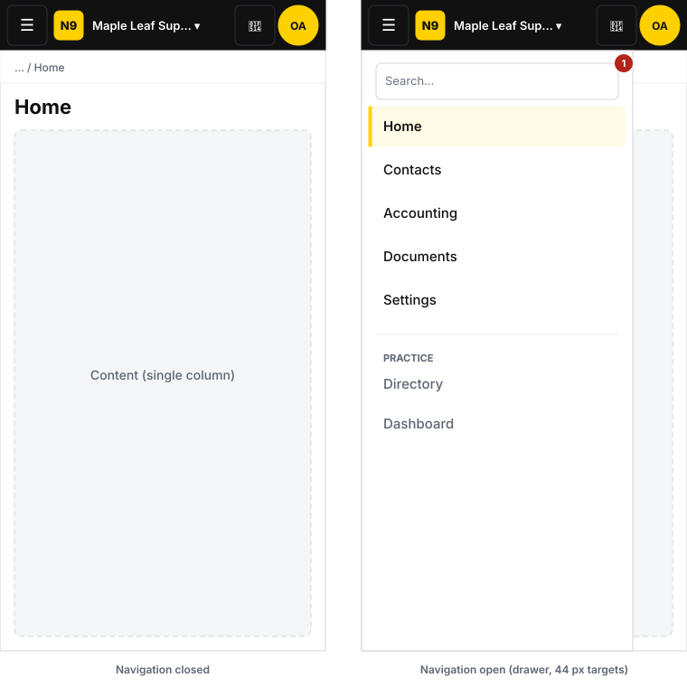

Below 1024 px the top navigation collapses into a menu button (44 × 44 px) that opens a drawer with
search, the module list and the practice links; the org switcher truncates the name; the bell and
user menu stay visible. No horizontal scroll at 360 px.

## 2. Organisation directory (practice workspace)

| Marker | Region | Behaviour |
|---|---|---|
| 1 | Saved views rail | Personal and shared views; selected view highlighted |
| 2 | Search + filter chips | Search name, BN, owner, tag (`/` focuses); chips: Package, Status, Province, Fiscal year end, GST cycle, Group |
| 3 | Grid settings | Column chooser, density (comfortable/compact), save view |
| 4 | Bulk bar | Appears when rows are selected: Add to group, Tags, Assign staff, Message, Export |
| 5 | DataGrid | Virtualised; columns Organisation, BN, Province, Package, Status, FYE, Overdue, Assigned; `Space` select, `Enter` open, `B` bulk bar |

States: first-run empty state ("Create your first organisation" + "Open a demo"), no results, loading
skeleton, error with retry.

## 3. Settings — General

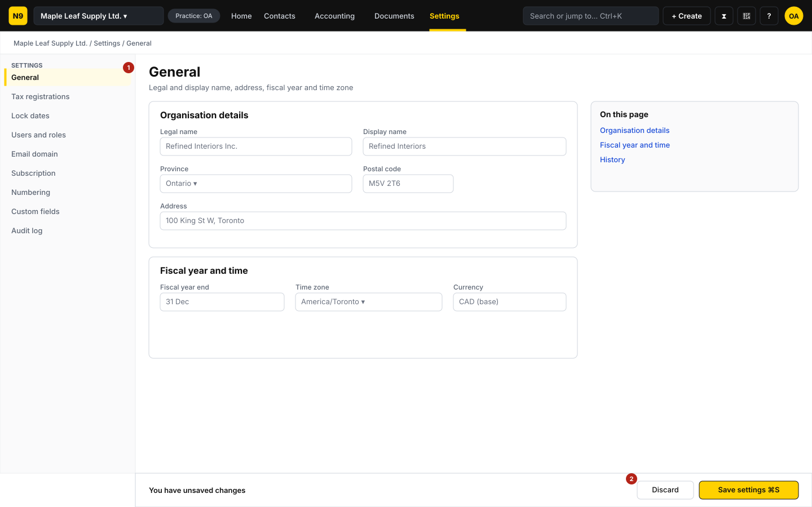

| Marker | Region | Behaviour |
|---|---|---|
| 1 | Settings navigation | Deep links `/o/:org/settings/{general, registrations, lock-dates, users-roles, email-domain, subscription, numbering, custom-fields, audit-log}`; each module's gear links its own section (gap 3) |
| 2 | Sticky save bar | Appears on first change: "You have unsaved changes", Discard, Save settings (`⌘S`); leaving with unsaved changes asks first |

Form uses Province picker and Postal code input; "On this page" anchors on wide screens.

## 4. Contacts

| Marker | Region | Behaviour |
|---|---|---|
| 1 | Role tabs | All contacts / Customers / Suppliers with counts; the page title follows the tab (gap 19) |
| 2 | DataGrid | Name, Role, Email, Phone, Province, Balance owing, Overdue |
| 3 | Empty state | Explains the next step with two actions: New contact, Import contacts |

## 5. Chart of accounts

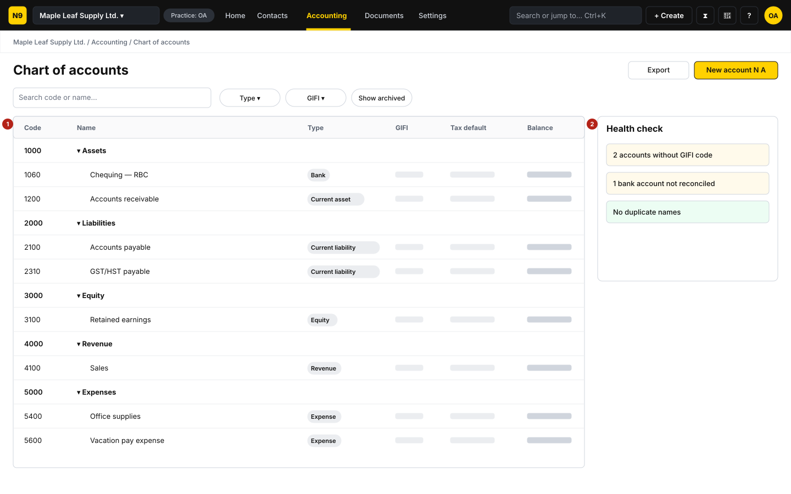

| Marker | Region | Behaviour |
|---|---|---|
| 1 | Tree grid | Headers (Assets, Liabilities, Equity, Revenue, Expenses) collapse; columns Code, Name, Type badge, GIFI, Tax default, Balance; archived toggle |
| 2 | Health check | Accounts without a GIFI code, unreconciled bank accounts, duplicates |

`N A` creates an account.

## 6. Journal (basic, C-02 test path)

| Marker | Region | Behaviour |
|---|---|---|
| 1 | Header | Date (forgiving input, displayed `26 Oct 2026`), Narration, Book (Both / Tax / Management), Number (auto) |
| 2 | LineGrid | The shared document line editor (A-10-T11): account picker, description, tax, debit, credit; arrows move, `Enter` on the last row adds a line, drag to reorder |
| 3 | Balance message | Names both totals and the difference (§3.5 microcopy); Post is disabled until the difference is $0.00 |

`⌘Enter` posts; the posted journal gets its number and a "Reverse" action.

## 7. Platform console

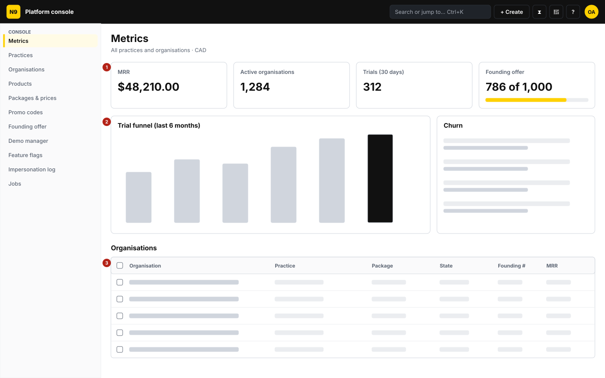

| Marker | Region | Behaviour |
|---|---|---|
| 1 | KPI tiles | MRR, active organisations, trials, founding offer counter ("786 of 1,000") |
| 2 | Charts | Trial funnel and churn; empty data renders as 0, never "—k" |
| 3 | Organisations grid | Organisation, Practice, Package, State, Founding #, MRR |

Console navigation: Metrics, Practices, Organisations, Products, Packages & prices, Promo codes,
Founding offer, Demo manager, Feature flags, Impersonation log, Jobs.

## 8. Package editor (U-02-T01)

U-02 adds three console frames: the package editor, the price timeline with its schedule dialog and
the promo-code list. Sample data: a "Growth" package (names are client data, entered by the
Platform Owner — never code).

| Marker | Region | Behaviour |
|---|---|---|
| 1 | Header actions | Status chip (Draft / Active / Retired); History (record history drawer, audit A-04); Save draft; Activate package (draft → active) or Retire package (active → retired). Activating with no product is refused with a message, never a disabled button without reason |
| 2 | Product cards | One card per sellable product (main and active companion apps) with a switch; planned companion apps are greyed and can't be switched on; Practice and Client portal are free and part of every package (not toggled) |
| 3 | Limits | Organisation users (number or Unlimited); practice users are never counted |
| 4 | Founding offer | Switch: the package is eligible for the founding-1,000 offer (U-08) |
| 5 | Live preview | The public pricing card exactly as the website (Q-01) will show it, from the unsaved form: name, description, monthly/annual toggle, current price, products, user limit, founding badge |
| 6 | States | Empty list (first package), refused activation, field errors under each field (the API's field form) |

Retired package: a notice says it is hidden from sign-up and how many organisations keep their
subscription. Delete is offered for drafts only and is refused while anyone subscribes (retire instead).

## 9. Price timeline and schedule dialog (U-02-T01)

| Marker | Region | Behaviour |
|---|---|---|
| 1 | Timeline per interval | Monthly and Annual rows; each price version is a bar from its start date to the next version's start (no end = open); the version in force today is highlighted |
| 2 | Today marker | Red line with today's date; versions after it are "Scheduled" and can be deleted until they start |
| 3 | Schedule a price change | Interval, new price (CAD, before GST/HST), start date (today or later) |
| 4 | Impact | "N subscriptions affected at their next renewal" — the count comes from the API for the chosen package, interval and date; renewals before the date keep the old price; grandfathered subscriptions never change |

A started price is never edited (Stripe prices are immutable): a change is always a new version.
Two versions can't overlap; the API's error is shown in the dialog.

## 10. Promo codes (U-02-T01)

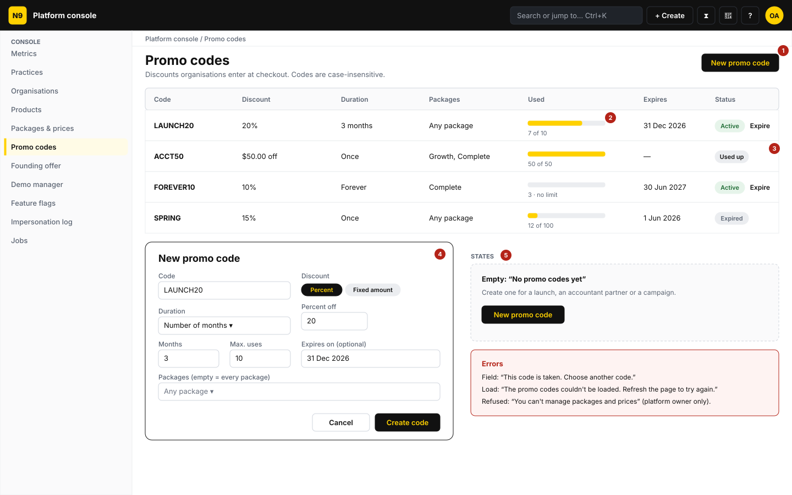

| Marker | Region | Behaviour |
|---|---|---|
| 1 | New promo code | Opens the create dialog |
| 2 | Usage bar | Redemptions ÷ maximum ("7 of 10"); no maximum → "3 · no limit" |
| 3 | Status and Expire | Active / Used up / Expired; Expire ends an active code now (redemptions already made are kept) |
| 4 | Create dialog | Code (case-insensitive, unique), percent or fixed amount (CAD), duration (once, number of months, forever), maximum uses, expiry date, package restriction (empty = every package) |
| 5 | States | Empty list, field error (code taken), load failure, refusal for anyone without `platform.catalogue.manage` |

## 11. Contacts list with role tabs (B-01-T01)

B-01 adds three frames: the contacts list with every role tab, the contact form with the live
duplicate panel and the merge dialog. They extend frame 4 (A-10-T02), which showed only All /
Customers / Suppliers. Sample data is Canadian (Ontario and Quebec contacts, CAD and one USD
contact); contact numbers use the `C-0001` pattern.

| Marker | Region | Behaviour |
|---|---|---|
| 1 | Role tabs | All contacts · Customers · Suppliers · Contractors · Agencies · Archived, each with its count. The page title, the browser tab title, the breadcrumb, the intro line and the primary button follow the tab ("Customers", "New customer") — gap-19. Roles are set on the contact, never inferred from transactions, so a new customer appears under Customers at once. Employees are reached from People/HR, not a tab here |
| 2 | Saved views | Personal and shared views (filters, columns, sort) per tab |
| 3 | Search, filter chips, column chooser | Search name, email, BN, tax ID, contact number (`/` focuses; accents ignored: "erable" finds "Érable"); chips Province, Currency, Credit mode; Columns and Save view |
| 4 | DataGrid | Number, Name, Roles, Email, Province, Currency, Credit limit (with warn/block), Balance owing; `Enter` opens; row actions Open, Edit, Archive, Merge with… |
| 5 | Bulk bar | Archive, Merge (exactly two selected), Export, Add role |
| 6 | States | Empty tab explains the role and offers New / Import; Archived tab: archived contacts keep their history and can be restored (archive = soft delete, never a hard delete) |

## 12. Contact form and live duplicate panel (B-01-T01)

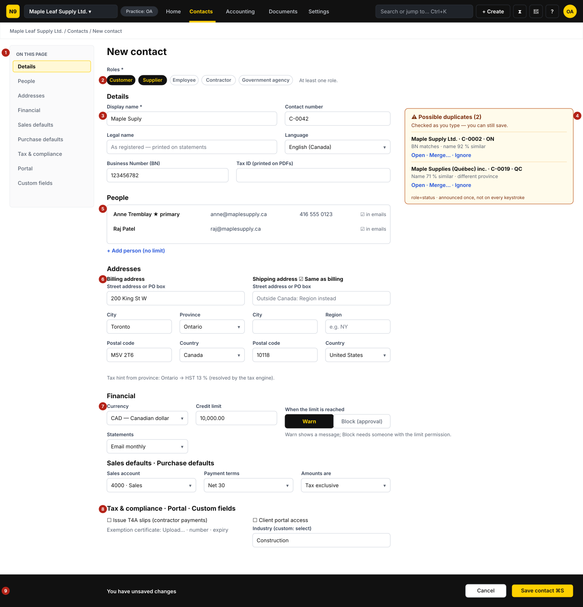

| Marker | Region | Behaviour |
|---|---|---|
| 1 | On this page | One page with section anchors: Details, People, Addresses, Financial, Sales defaults, Purchase defaults, Tax & compliance, Portal, Custom fields; the current section is highlighted while scrolling |
| 2 | Role chips | Customer, Supplier, Employee, Contractor, Government agency; at least one is required ("Choose at least one role.") |
| 3 | Details | Display name (required), contact number (next from the sequence, editable, unique), legal name, language (EN/FR for documents), Business Number (9 digits, check digit), Tax ID |
| 4 | Possible duplicates panel | Appears within 300 ms after typing stops (debounced) on display name, email, BN or tax ID: name similarity ≥ 60 % (accents and case ignored) or an exact email / BN / tax ID match; each row says why it matched and offers Open, Merge…, Ignore. A warning, never a block: same name in another province is shown, saving is still allowed. Announced once to screen readers (`role="status"`) |
| 5 | People | Unlimited people; one primary (★); "include in emails" per person |
| 6 | Addresses | Billing and shipping (shipping "Same as billing" by default). Canada: Province dropdown (13) and Postal code `A1A 1A1` checked against the province; other countries: Region and Postal code as free text. The province's tax hint is shown (QC → GST + QST, ON → HST 13 %) and resolved to a tax code by G-02 |
| 7 | Financial | Currency (ISO 4217, CAD by default), credit limit with Warn / Block segmented control and its explanation, statement preference |
| 8 | Defaults and compliance | Sales/purchase account, payment terms (master list), amounts are; T4A flag; exemption certificate (file, number, expiry); portal access; custom fields defined in Settings (text, number, date, select; up to 30) |
| 9 | Sticky save bar | "You have unsaved changes", Cancel, Save contact (`⌘S`); field errors under each field |

## 13. Merge contacts dialog (B-01-T01)

| Marker | Region | Behaviour |
|---|---|---|
| 1 | Keep / merge in | The contact to keep is chosen first (the older one by default); the columns can be swapped |
| 2 | Field chooser | One row per field with a radio per side; roles can be kept as the union of both |
| 3 | What moves | Counts of every record that points at the merged contact (invoices, bills, credit notes, journal lines, people, attachments) from the merge registry; the merged contact number stays as an alias; its history shows on the kept contact |
| 4 | Refusal | Contacts in different currencies can't be merged (message names both currencies); other refusals the same way, never a disabled button without reason |
| 5 | Merge | Runs in one transaction: if any step fails nothing changes; the merge is in the audit log |

## 14. Organisation directory states (V-01-T01)

UX brief: [Organisation directory — UX research brief](directory-ux-brief.md).

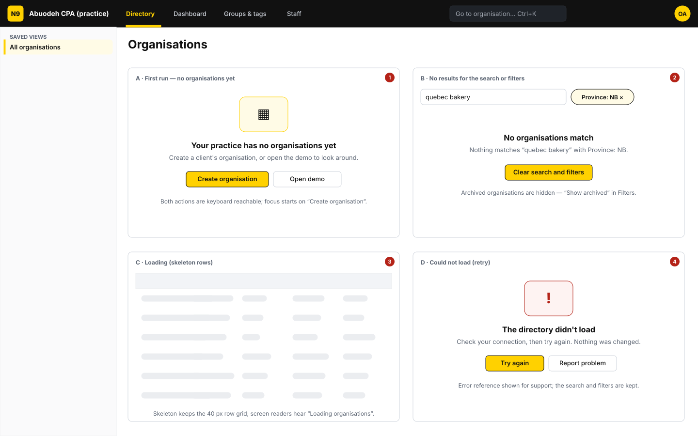

| Marker | Region | Behaviour |
|---|---|---|
| 1 | First run | The practice has no organisations: "Create organisation" (primary, focused first) and "Open demo" |
| 2 | No results | Says what was searched and filtered; "Clear search and filters"; archived organisations are hidden unless "Show archived" is on |
| 3 | Loading | Skeleton rows at the grid's row height; "Loading organisations" in the live region |
| 4 | Error | "The directory didn't load", Try again (keeps the search and filters), Report problem |

## 15. Directory saved views, filters with counts, column chooser (V-01-T01)

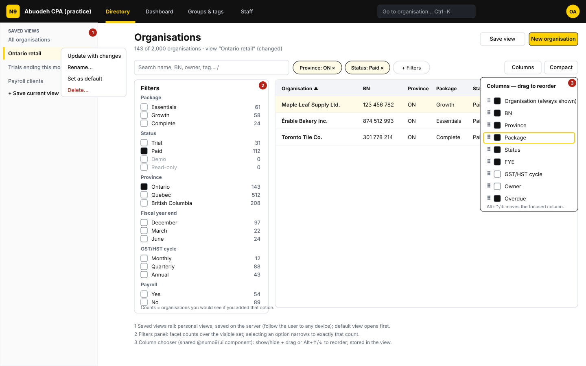

| Marker | Region | Behaviour |
|---|---|---|
| 1 | Saved views rail | The user's own views, stored on the server (they follow the user after logout/login and on another device); one can be the default; item menu: Update with changes, Rename, Set as default, Delete. A view with unsaved changes reads "(changed)" |
| 2 | Filters panel | Package, Status, Province, Fiscal year end, GST/HST cycle, Payroll, Overdue items, Unfiled returns, Show archived. Each option shows the number of organisations the list would show with that option added (every other filter applied); zero options stay, dimmed |
| 3 | Column chooser | Shared `@numo9/ui` component: show/hide and reorder (drag handle or `Alt+↑/↓`); the Organisation column always stays; order and visibility are saved in the view |

## 16. Go to organisation and keyboard map (V-01-T01)

| Marker | Region | Behaviour |
|---|---|---|
| 1 | Go to organisation | `Ctrl/⌘+K` anywhere in the app; the same search as the directory (accent-insensitive name, BN with or without spaces, owner, tag); matches highlighted; `Enter` opens, `Ctrl/⌘+Enter` opens in a new tab, `Esc` closes and returns focus |
| 2 | Keyboard map | `/` search, `↓` into the rows, `↑/↓ PgUp/PgDn Home/End` move, `Enter` open, `Ctrl/⌘+Enter` new tab, `F` filters panel, `Ctrl/⌘+K` go to organisation |

## 17. Import contacts — step 1, Upload (B-03-T01)

B-03 adds a four-step wizard (Upload → Map columns → Review → Import) reached from the contacts list
(Import in the bulk bar and in the empty state, frame 11) and, with the same frames and other field
names, from the chart of accounts (C-01-T13). Every step shows the step bar; Back keeps what was
chosen; nothing is saved before the last step. Sample file: a Quebec client list exported from an
old system with French headers, saved in Windows-1252.

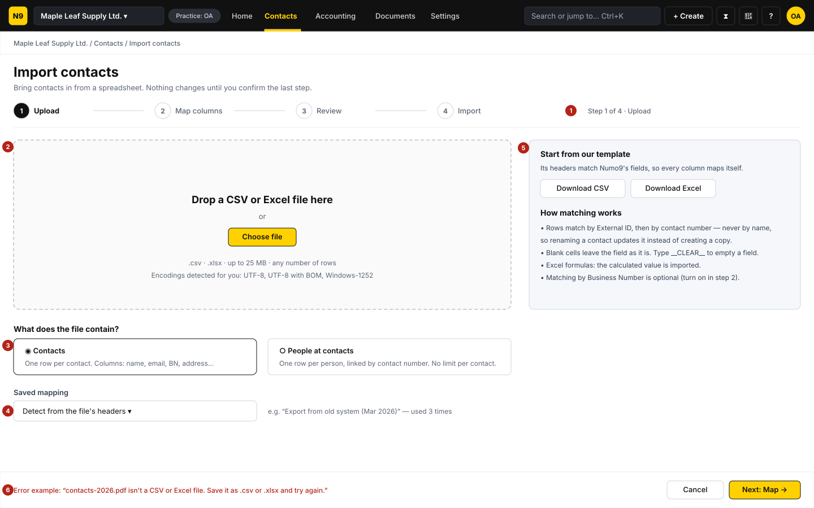

| Marker | Region | Behaviour |
|---|---|---|
| 1 | Step bar | Four steps, the current one in black, finished ones with a check; steps can't be skipped. The live region announces "Step 1 of 4, Upload" |
| 2 | Drop zone | Drag and drop or Choose file (keyboard: `Enter`/`Space`); `.csv` and `.xlsx`, up to 25 MB (A-06 limit); the encoding is detected (UTF-8, UTF-8 with BOM, Windows-1252) — never asked |
| 3 | File contents | Contacts (one row per contact) or People at contacts (one row per person, linked by contact number or External ID, no limit per contact — B-03-T09) |
| 4 | Saved mapping | "Detect from the file's headers" by default; a saved mapping of the organisation is chosen automatically when the headers are the same; the list shows how often each was used |
| 5 | Template and rules | Download the CSV or Excel template (headers = the mapping fields, B-03-T13); the matching rules in plain words: External ID, then contact number, never the name; blank cells leave fields unchanged; `__CLEAR__` empties a field; formulas import their values |
| 6 | Errors | Wrong type, empty file, too large, no header row: the message says what to do ("Save it as .csv or .xlsx and try again"); Next stays enabled and explains on click rather than being disabled without a reason |

## 18. Import contacts — step 2, Map columns (B-03-T01)

| Marker | Region | Behaviour |
|---|---|---|
| 1 | Step bar | As frame 17; the subtitle summarises the file: name, rows, columns, detected encoding, header row |
| 2 | Columns | One row per column of the file, in file order, with the first three non-empty sample values |
| 3 | Numo9 field | A select per column, pre-filled by auto-suggest (B-03-T03): English and French field names and synonyms, accents and case ignored ("Courriel" → Email, "NE" → Business Number, "Code postal" → Billing postal code); "Don't import" when nothing fits |
| 4 | Match confidence | Exact / Exact (FR) for a known header, Similar for a fuzzy match (to check), You chose after a manual change, No match. Similar matches are listed first in the screen-reader summary |
| 5 | Match keys and required fields | Rows match existing contacts by External ID, then contact number; Business Number only when switched on, and only when the first two are empty; never by name, so a renamed contact is updated (gap-21). Display name must be mapped |
| 6 | Save this mapping | Name the mapping; stored per organisation and entity (`ImportMapping`); the next file with the same headers maps itself |
| 7 | Validation | A field can be mapped from one column only; the message names both columns and the field |

## 19. Import contacts — step 3, Review the dry run (B-03-T01)

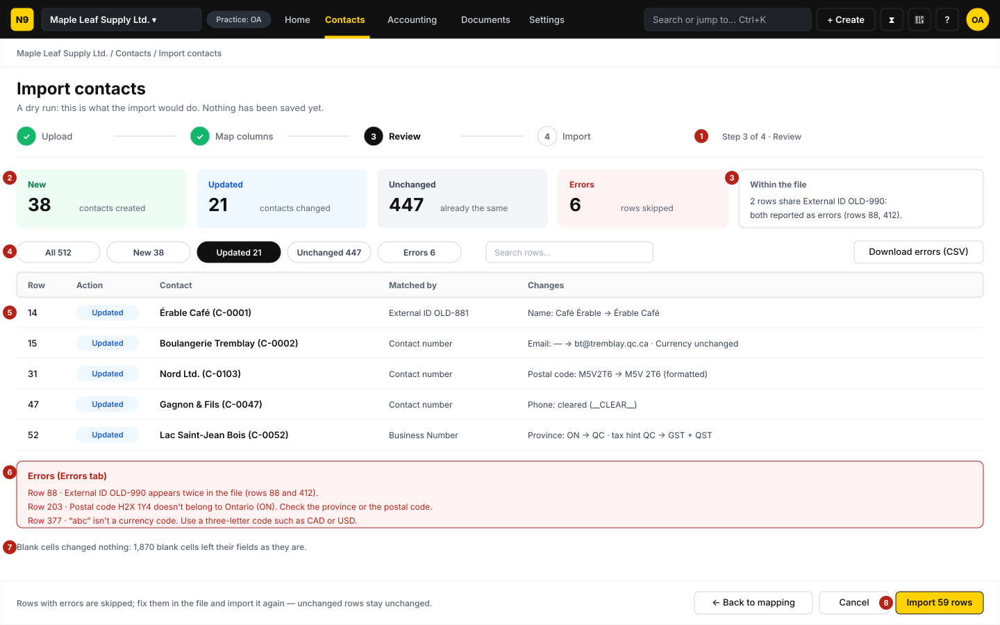

| Marker | Region | Behaviour |
|---|---|---|
| 1 | Step bar | "A dry run: nothing has been saved yet" |
| 2 | Counts | New, Updated, Unchanged, Errors — each count opens its tab; New + Updated is the number the Import button shows |
| 3 | Within the file | Duplicates inside the file (same External ID or contact number on two rows): every copy is an error naming the other rows |
| 4 | Tabs, search, errors CSV | Filter by action; search by row number, name or number; Download errors gives a CSV with the row number, the column and the reason |
| 5 | Rows | Row number, action chip, contact (name and number), how it matched, and each changed field as "before → after"; formatted values (postal code spacing) are shown as such; `__CLEAR__` shows as "cleared" |
| 6 | Errors | One plain-language reason per row (province/postal code mismatch, unknown currency, invalid email, BN check digit, duplicate in file) — B-03-T04 validators |
| 7 | Blank cells | States that blank cells changed nothing (non-destructive updates, gap-21) |
| 8 | Import | "Import N rows" (new + updated); rows with errors are skipped, never half-imported |

## 20. Import contacts — step 4, Import (B-03-T01)

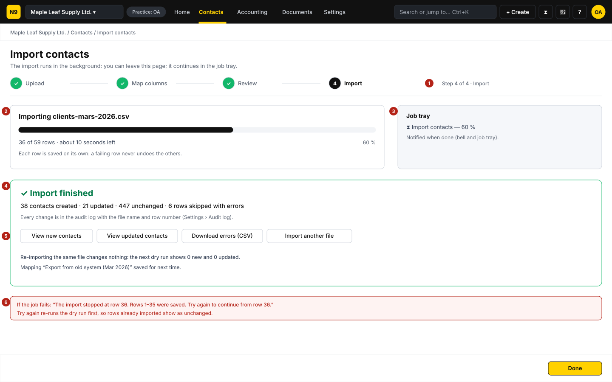

| Marker | Region | Behaviour |
|---|---|---|
| 1 | Step bar | Final step; leaving the page doesn't stop the import |
| 2 | Progress | Background job (A-08) with rows done / total and time left; percentage in a polite live region; each row is its own transaction |
| 3 | Job tray | The same job in the job tray; the bell notifies when it finishes (A-07) |
| 4 | Result | Created / updated / unchanged / skipped counts; every change is in the audit log with the file name and row number |
| 5 | Next actions | Open the created or updated contacts (filtered list), download the errors CSV, import another file. Re-importing the same file shows 0 new and 0 updated (gap-21) |
| 6 | Failure | If the job stops, the message says which rows were saved; Try again re-runs the dry run so saved rows show as unchanged |

## 21. Groups & tags — group tree (V-02-T01)

| Marker | Region | Behaviour |
|---|---|---|
| 1 | New group | Creates a group at the top level or, with a group selected, inside it; name required, unique among its siblings |
| 2 | Tree | Practice-scoped groups with organisation counts ("All organisations" and "No group" are views, not groups); drag a group onto another to move it with its sub-groups; a group can't go inside itself; depth 5 at most |
| 3 | Move to… | The keyboard alternative to dragging: search groups, `↑/↓` choose, `Enter` move, `Esc` cancel; the current parent is marked; refused moves say why (depth 5, inside itself) |
| 4 | Organisations of the group | The directory grid (V-01) filtered to the group, with Groups and Tags columns; an organisation can be in several groups |

## 22. Tag picker (V-02-T01)

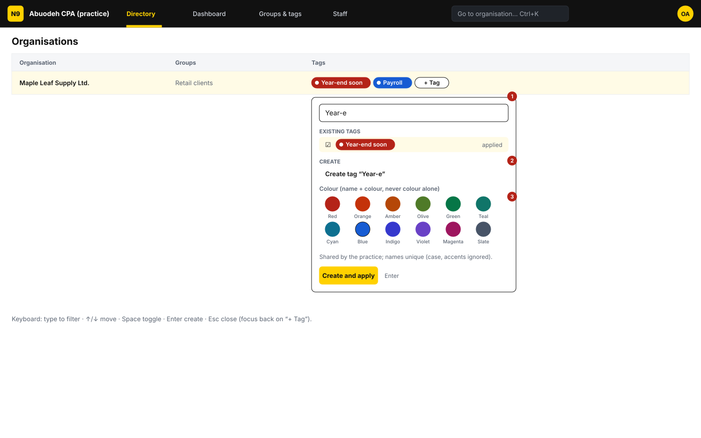

| Marker | Region | Behaviour |
|---|---|---|
| 1 | Search | Opens from "+ Tag" on a row (or the bulk bar); typing filters the practice's tags; `Space` toggles one |
| 2 | Create | When no tag has the typed name: "Create tag “…”" — created and applied in one step (`Enter`) |
| 3 | Colour | 12 accessible colours, each with its name; a tag always shows its name next to the colour (never colour alone); names are unique per practice, case and accents ignored |

## 23. Group staff panel and delete-group dialog (V-02-T01)

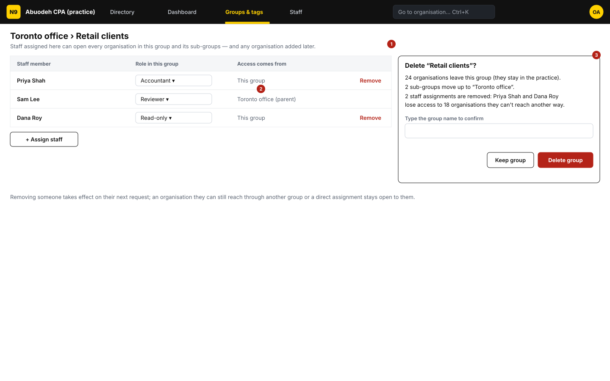

| Marker | Region | Behaviour |
|---|---|---|
| 1 | Group staff | Staff assigned to a group can open every organisation in it and its sub-groups, including organisations added later; one role per person per group |
| 2 | Inherited access | "Access comes from" names the group that grants it; inherited rows (from a parent group) are changed on that group |
| 3 | Delete group | Practice admins only; the dialog counts what changes — organisations leaving the group (they stay in the practice), sub-groups moving up, staff assignments removed and the organisations people lose access to (those they can't reach another way); typed confirmation |

## 24. Contact activity timeline (B-02-T01)

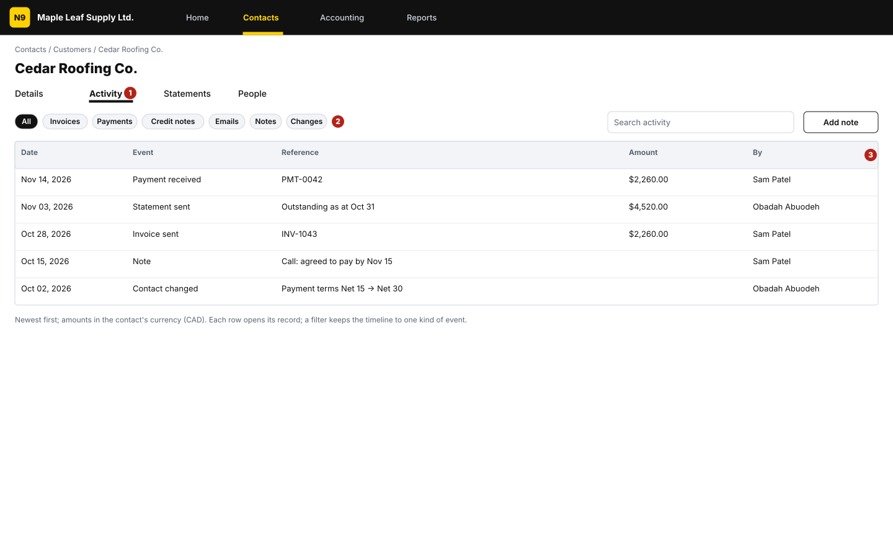

| Marker | Region | Behaviour |
|---|---|---|
| 1 | Activity tab | One timeline per contact: documents, payments, emails, notes and changes, newest first |
| 2 | Type filter | Chips per kind of event ("All" by default); search within the timeline |
| 3 | Rows | Date, event, reference, amount (contact's currency, blank when none), who; each row opens its record |

## 25. Statement preview and send (B-02-T01)

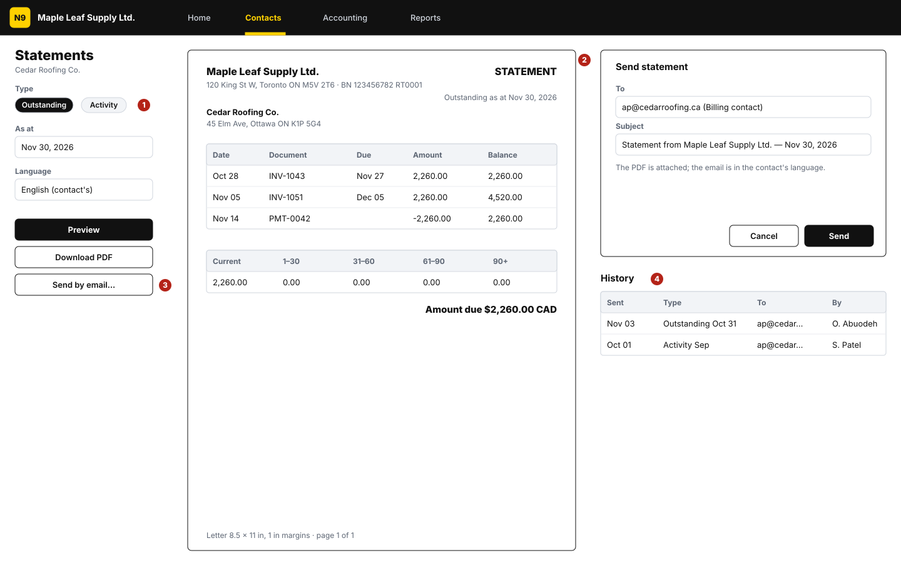

| Marker | Region | Behaviour |
|---|---|---|
| 1 | Options | *Outstanding* (as at a date) or *Activity* (a date range with opening balance); language defaults to the contact's |
| 2 | Preview | Exactly the PDF: Letter 8.5 × 11 in with 1 in margins, organisation and contact addresses, lines, aging buckets (Current, 1–30, 31–60, 61–90, 90+), amount due in the contact's currency |
| 3 | Send | Email to the contact's billing person with the PDF attached (A-07); subject and body in the contact's language |
| 4 | History | Every statement sent (date, type, recipients, who); it also appears on the activity timeline |

## 26. Supplier statement reconciliation (B-02-T01)

| Marker | Region | Behaviour |
|---|---|---|
| 1 | Summary | Their balance, ours, the difference and what explains it (their lines without a bill, bills not on their statement) |
| 2 | Two columns | Their statement lines and our bills side by side; auto-match by invoice number, then by amount within ±3 days; unmatched highlighted |
| 3 | Manual match | Select one line on each side and match; notes on a line; the difference updates at once |
| 4 | Import | Their statement from CSV/XLSX with a column mapping (date, invoice number, amount, reference) or typed lines; lines added = rows in the file |

## 27. Platform console — organisations and detail (U-06-T01)

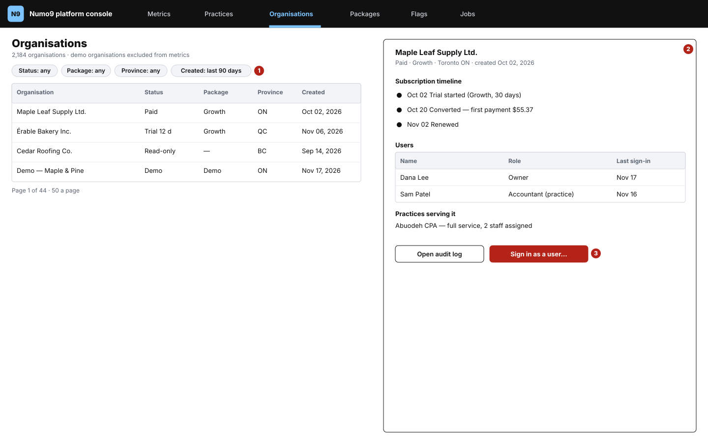

| Marker | Region | Behaviour |
|---|---|---|
| 1 | Filters | Status, package, province, created (range); paged, 50 a page; demo organisations listed but marked |
| 2 | Detail | Status, package, province, created; subscription timeline (trial started, converted, renewed, read-only…) from the status history |
| 3 | Actions | *Open audit log* (the organisation's log, as platform staff) and *Sign in as a user…* (`platform.impersonate`) |

## 28. Platform console — audited sign-in as a user (U-06-T01)

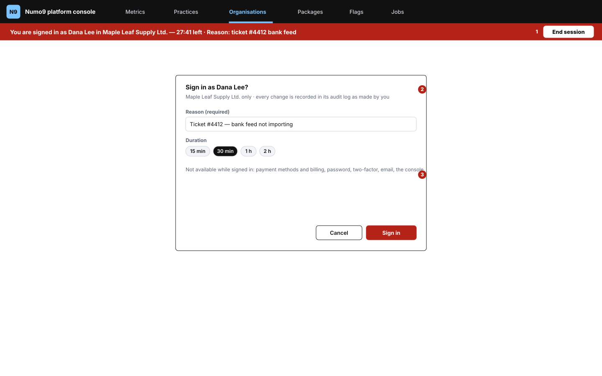

| Marker | Region | Behaviour |
|---|---|---|
| 1 | Red bar | On every page while signed in as someone: who, which organisation, time left (counting down), the reason; *End session* |
| 2 | Start | One organisation only; reason required; 15 min to 2 h (default 30 min); everything done is in that organisation's audit log as "<user> — signed in by <staff>" |
| 3 | Blocked | Payment methods and billing, password, two-factor, email address, the console itself: refused while signed in as someone |

## 29. Platform console — metrics and feature flags (U-06-T01)

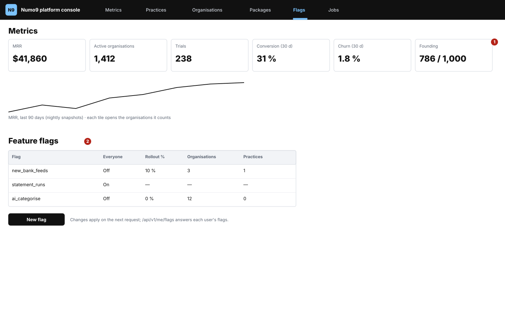

| Marker | Region | Behaviour |
|---|---|---|
| 1 | KPI tiles | MRR (CAD, annual ÷ 12), active organisations, trials, conversion, churn, founding x / 1,000 — demo organisations never counted; each tile opens the organisations it counts (same number) |
| 2 | Feature flags | Everyone on/off, rollout %, chosen organisations and practices; a change applies on the next request; `/api/v1/me/flags` answers a user's flags |

## 30. Directory — bulk selection and actions (V-03-T01)

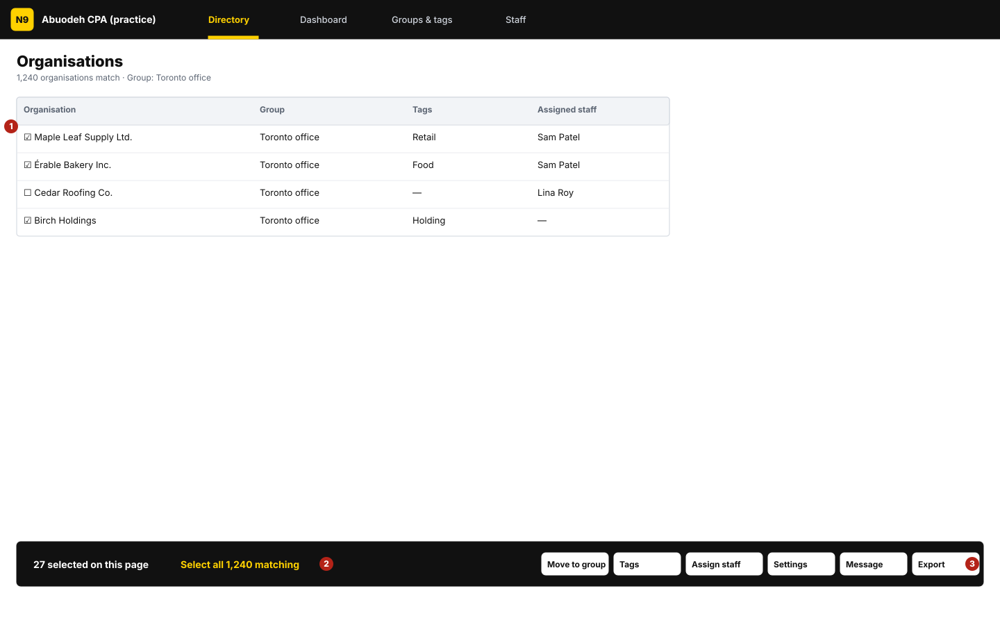

| Marker | Region | Behaviour |
|---|---|---|
| 1 | Row checkboxes | One per row and one for the page; the selection survives paging and sorting |
| 2 | Selection bar | Appears at the bottom once something is selected: "27 selected on this page · Select all 1,240 matching" — *all matching* sends the directory query (search, filters), never a list of ids |
| 3 | Actions | Move to group, tags (add/remove), assign staff, settings (safe settings only), message the organisations, export (CSV/XLSX) |

## 31. Bulk action — preview (V-03-T01)

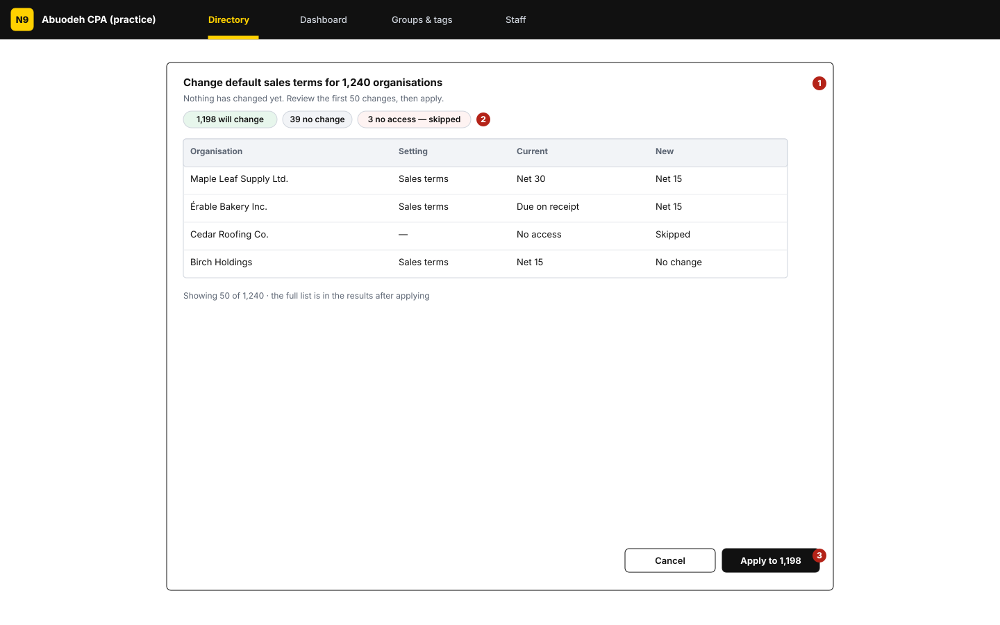

| Marker | Region | Behaviour |
|---|---|---|
| 1 | Nothing changed yet | The preview computes every change without writing anything |
| 2 | Counts | Will change / no change / no access (skipped) — every selected organisation is in one of them |
| 3 | Apply | Confirms and starts one background job; the first 50 changes are shown with the total |

## 32. Bulk action — progress and results (V-03-T01)

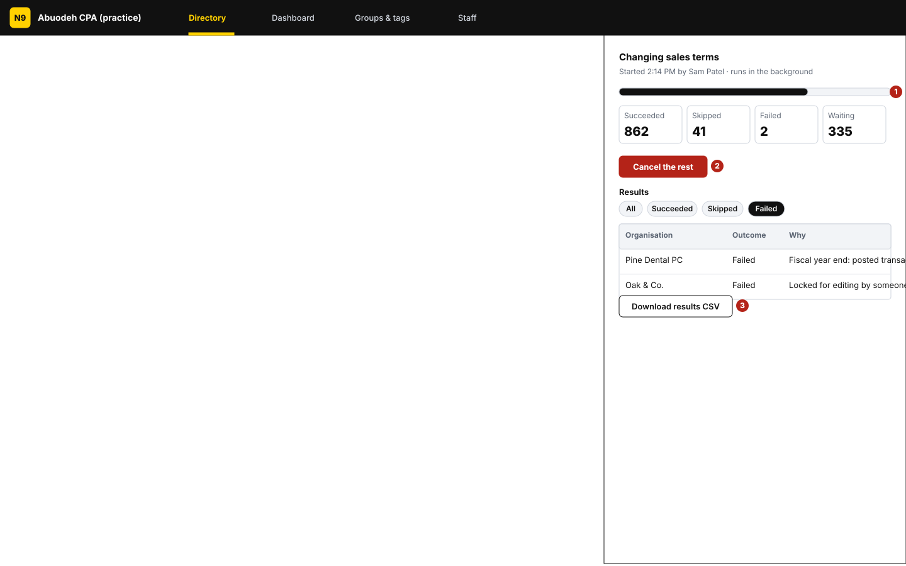

| Marker | Region | Behaviour |
|---|---|---|
| 1 | Progress | Live counters (succeeded, skipped, failed, waiting); the job keeps running if the drawer is closed (job tray) |
| 2 | Cancel | Stops before the next organisation: done rows stay done, the rest are *cancelled* — never a silent partial result |
| 3 | Results | Every organisation has an outcome and a reason; filter by outcome; download the CSV |

## 33. Practice staff — list (V-05-T01)

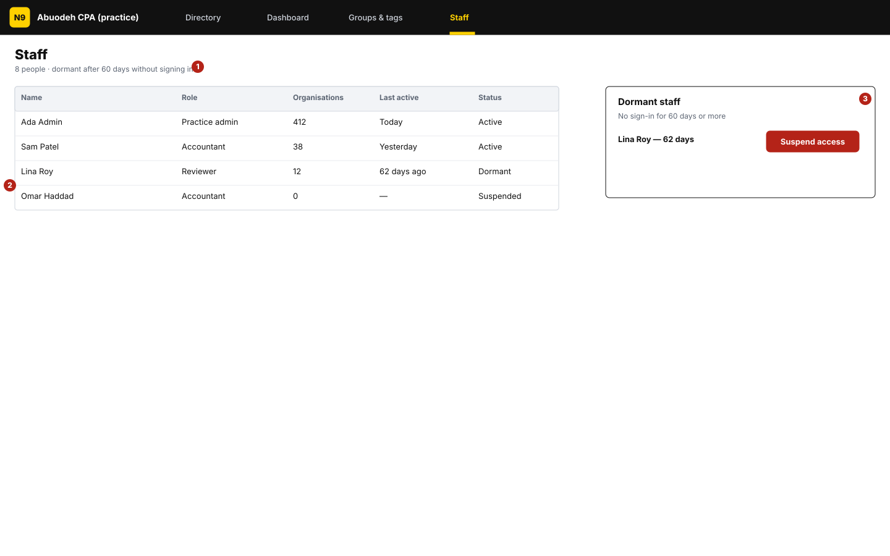

| Marker | Region | Behaviour |
|---|---|---|
| 1 | Dormant rule | A person who hasn't signed in for 60 days (configurable) is *dormant* — day 60, not 59 |
| 2 | Staff table | Name, practice role, organisations they can open, last active, status: active, dormant, suspended, pending invitation |
| 3 | Dormant widget | The practice admins' dashboard widget lists dormant staff with one-click *Suspend access* |

## 34. Practice staff — detail with heatmap (V-05-T01)

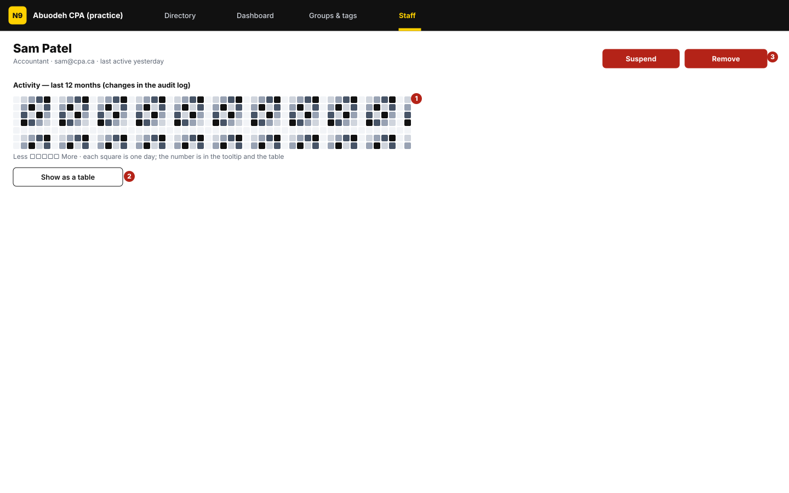

| Marker | Region | Behaviour |
|---|---|---|
| 1 | Heatmap | One square per day for 12 months; colour scale **and** the number in the tooltip (never colour alone); counts = the audit log's changes by that person |
| 2 | Table alternative | The same numbers as a table (screen readers, exact values) |
| 3 | Suspend / Remove | Suspend keeps the history and blocks access; remove revokes every organisation; the last practice admin can't be removed or suspended |

## 35. Practice staff — assignments (V-05-T01)

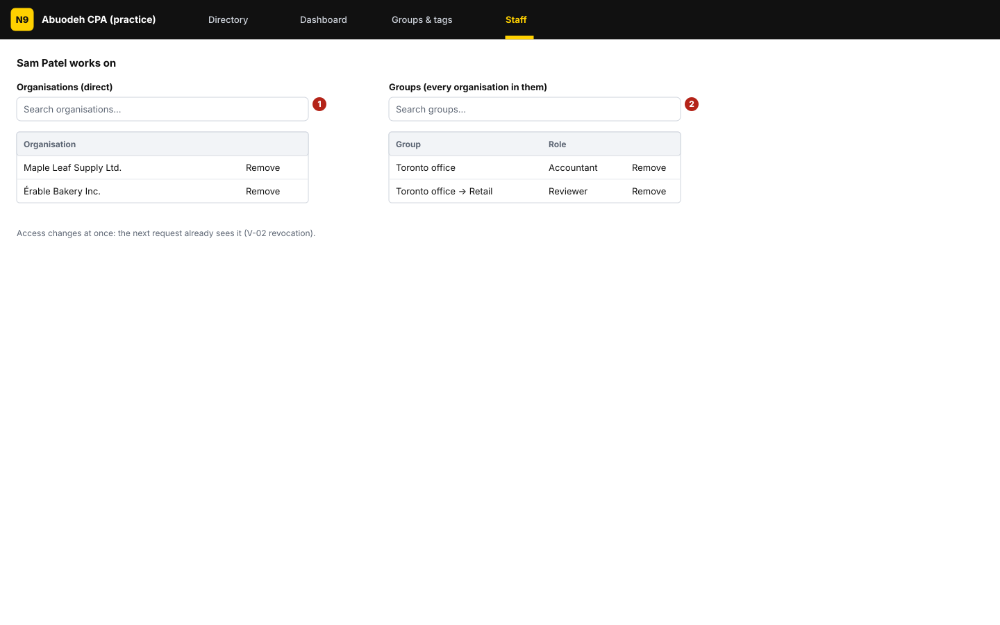

| Marker | Region | Behaviour |
|---|---|---|
| 1 | Organisations | Direct assignments: search to add, remove — effective on the next request |
| 2 | Groups | Group assignments with their role (every organisation filed in the group or its sub-groups) |

## 36. Practice home — cross-organisation dashboard (V-04-T01)

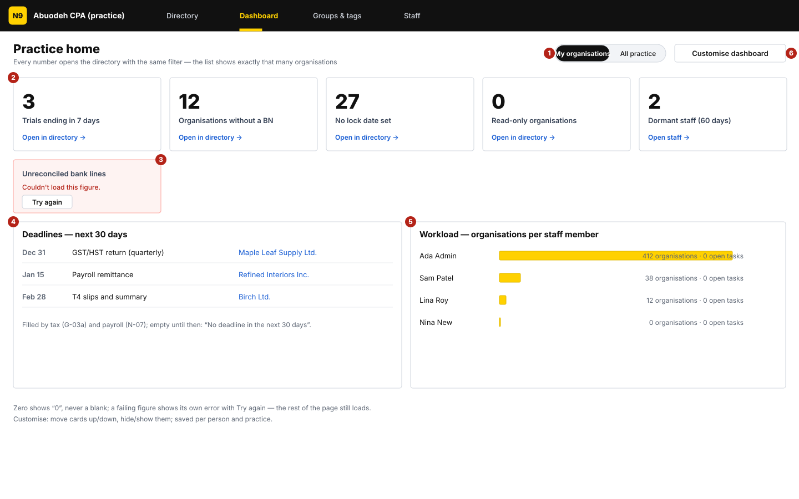

| Marker | Region | Behaviour |
|---|---|---|
| 1 | My organisations / All practice | Practice-wide roles choose; other staff always see their own organisations. The choice is part of every drill link |
| 2 | Cards | Large number, label, link. Phase 0: trials ending within 7 days, organisations without a BN, without a lock date, read-only, dormant staff (admins). The link opens the directory with the same filters (shareable URL): its count equals the card's number. Zero renders "0" |
| 3 | Card error | A provider that fails shows its own error with **Try again**; the other cards and the page still load (Xero gap #5, "Unable to load") |
| 4 | Deadlines (next 30 days) | Date, what, organisation (link). Filled by later phases (GST/HST G-03a, payroll N-07); until then "No deadline in the next 30 days" |
| 5 | Workload | Organisations per staff member (direct and through groups, as the directory counts them) and open tasks (0 until tasks exist), as bars with the number written |
| 6 | Customise | Move cards up/down and hide/show them; saved per person and practice |

## 37. Banking home — account cards and states (F-01-T01)

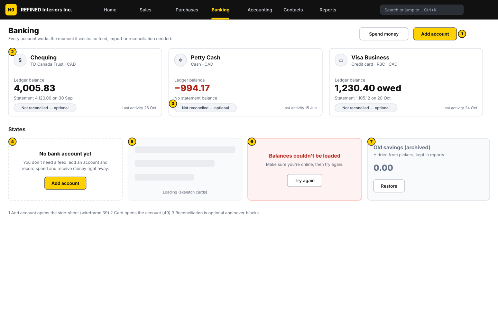

| Marker | Region | Behaviour |
|---|---|---|
| 1 | Add account | Opens the add-account side-sheet (wireframe 38). Spend money opens the form (40) for the first account |
| 2 | Account card | Type icon, name, institution and currency; **ledger balance** (always the ledger, never edited); the statement balance and its date when one was entered; last activity. Opens the account (39). A credit card or line of credit reads "owed" |
| 3 | Reconciliation chip | "Not reconciled — optional": reconciliation never blocks anything (Xero gap #27) |
| 4 | Empty state | No account yet: explains that no feed is needed; **Add account** |
| 5 | Loading | Skeleton cards while balances load |
| 6 | Error | Balances couldn't be loaded — **Try again**; nothing else on the page is blocked |
| 7 | Archived account | Shown under "Archived", greyed: hidden from pickers, kept in reports; **Restore** |

## 38. Add bank account — side-sheet (F-01-T01)

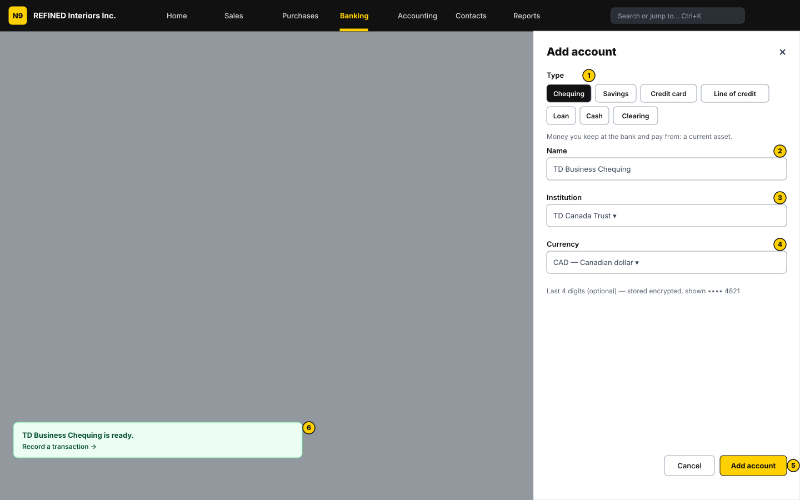

| Marker | Region | Behaviour |
|---|---|---|
| 1 | Type | Segmented control: Chequing, Savings, Credit card, Line of credit, Loan, Cash, Clearing — with a plain-language line under it ("Money you keep at the bank and pay from: a current asset"). The type decides the ledger account it creates (F-01-T03) |
| 2 | Name | Required, unique in the organisation |
| 3 | Institution | Canadian bank list with search; free text allowed |
| 4 | Currency | CAD by default; fixed once the account has transactions |
| 5 | Add account | Creates the account and its ledger account in one step (< 30 s); last 4 digits optional, stored encrypted, shown masked |
| 6 | Success toast | "… is ready." with the next action **Record a transaction** |

## 39. Bank account — detail (F-01-T01)

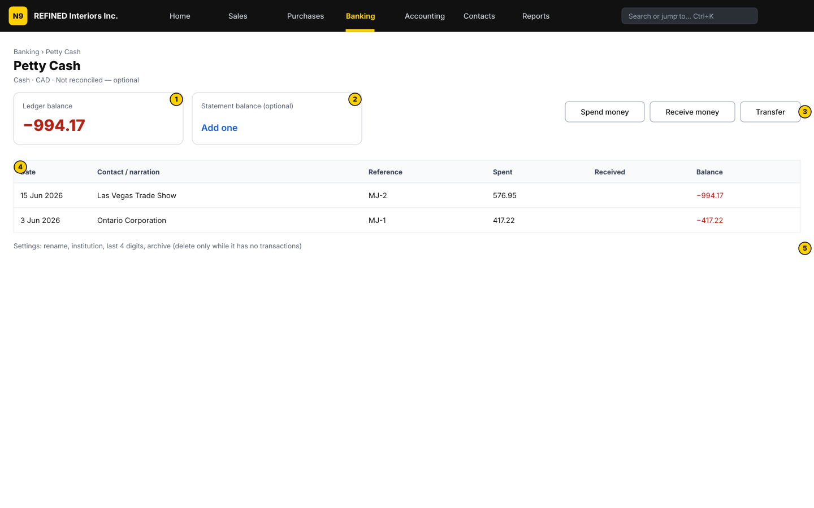

| Marker | Region | Behaviour |
|---|---|---|
| 1 | Ledger balance | The ledger account's balance (posted lines); red below zero |
| 2 | Statement balance | Optional, with its date; never changes the ledger |
| 3 | Actions | Spend money, Receive money, Transfer (a credit card paid from chequing is a transfer, not a spend) |
| 4 | Transactions | Date, contact or narration, reference, spent, received, running balance; opens the journal |
| 5 | Settings | Rename, institution, last 4 digits; archive; delete only while it has no transactions ("has 1 transaction — archive instead") |

## 40. Spend money / Receive money (F-01-T01)

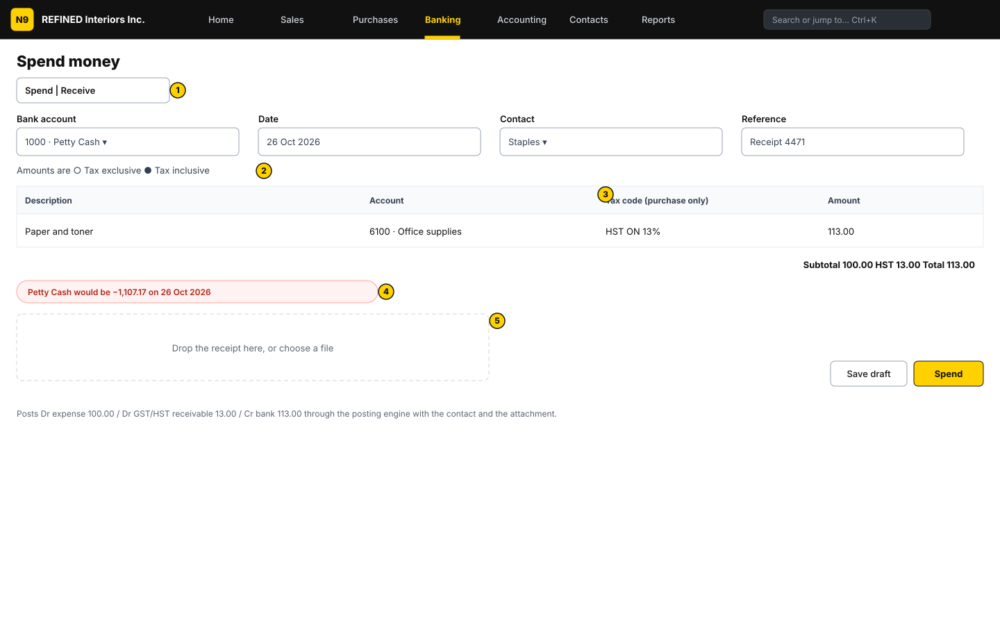

| Marker | Region | Behaviour |
|---|---|---|
| 1 | Spend / Receive | One form, two directions; quick-create N S / N R |
| 2 | Tax inclusive / exclusive | Changes how the line amounts are read; totals recalculate |
| 3 | Lines | Description, account, tax code (purchase codes for a spend, sales codes for a receipt — the others are filtered out), amount |
| 4 | Cash guard | The C-03 chip when the account would go below zero; blocked / adviser reason as on journals |
| 5 | Attachment | Drop the receipt; the C-03 attachment rules apply |

## 41. No bank account — dashboard prompt (F-01-T01)

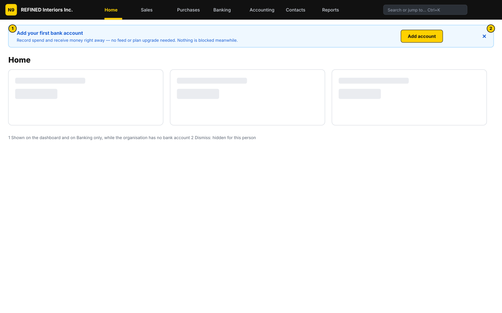

| Marker | Region | Behaviour |
|---|---|---|
| 1 | Prompt | "Add your first bank account": on the dashboard and on Banking only, while the organisation has none; nothing is blocked |
| 2 | Dismiss | Hides it for this person (persistent but dismissible) |

## 42. Tax codes — list (G-01-T01)

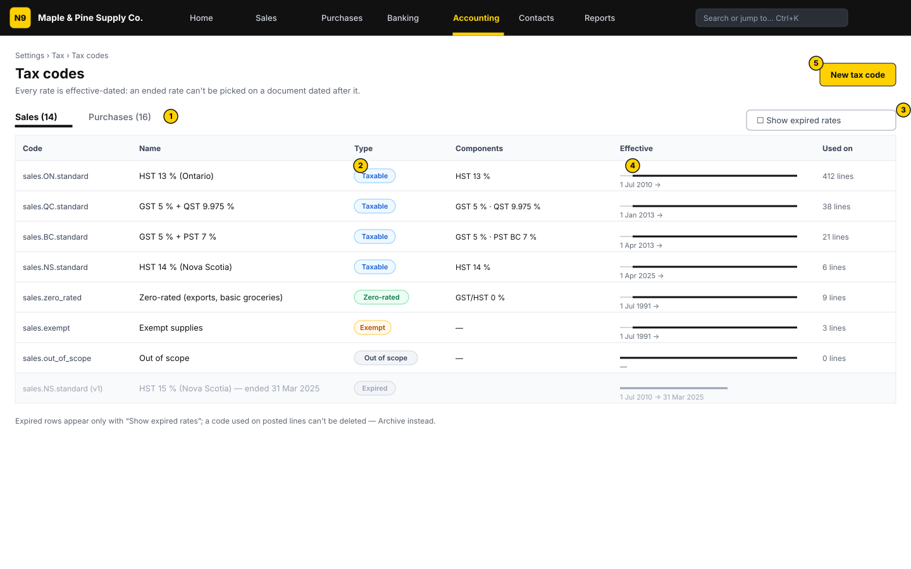

| Marker | Region | Behaviour |
|---|---|---|
| 1 | Sales / Purchases tabs | Separate lists per side, with counts: a sales line never offers a purchase code (gap-07) |
| 2 | Type badge | Taxable, Zero-rated, Exempt, Out of scope — zero-rated ≠ exempt ≠ out of scope (gap-08) |
| 3 | Show expired rates | Off by default: ended rates (NS HST 15 % to 31 Mar 2025, MB RST 8 % to 30 Jun 2019) are hidden and can't be picked on a later document |
| 4 | Effective timeline | Start → end of each version; the current version is solid, ended ones grey; "Used on" counts posted lines |
| 5 | New tax code | Opens the editor (wireframe 44); a code used on posted lines is archived, never deleted |

## 43. Tax code editor (G-01-T01)

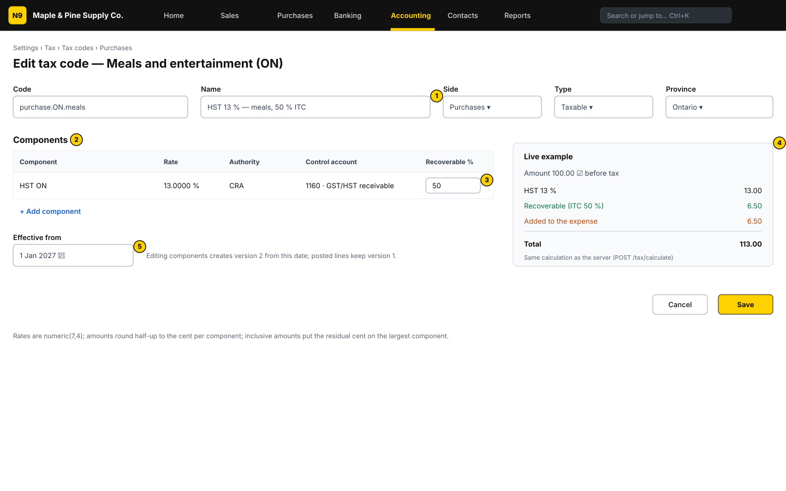

| Marker | Region | Behaviour |
|---|---|---|
| 1 | Header fields | Code, name, side, type, province; side and type decide which components fit (a sales code can't hold a purchase-only component) |
| 2 | Components | Component builder: rate (numeric 7,4), authority, control account; add or remove components |
| 3 | Recoverable % | Partial ITC/ITR (e.g. meals 50 %); resolution line › account › code (G-01-T05) |
| 4 | Live example | "100.00 → HST 13.00; recoverable 6.50; added to the expense 6.50" — the same numbers as the server's calculation |
| 5 | Effective from | Editing components creates a new version from this date; posted lines keep the old version |

## 44. Statement import — upload (F-02-T01)

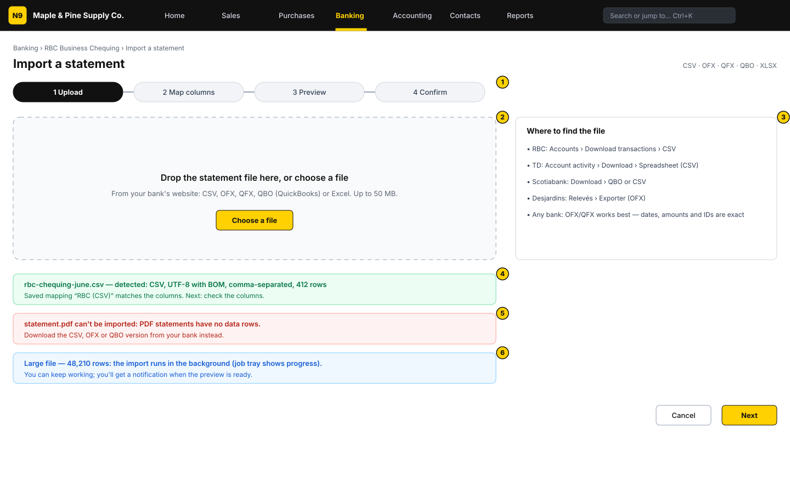

| Marker | Region | Behaviour |
|---|---|---|
| 1 | Stepper | Upload → Map columns → Preview → Confirm; nothing is written until Confirm |
| 2 | Drop zone | CSV, OFX, QFX, QBO, XLSX up to 50 MB; format and encoding (BOM, Latin-1) are detected, never assumed |
| 3 | Bank help | Where each Canadian bank puts its export; OFX/QFX is recommended |
| 4 | Detected | Format, delimiter, row count; a saved mapping that matches the columns is chosen automatically |
| 5 | Error state | Unsupported file (PDF, image): plain reason and what to download instead |
| 6 | Large-file state | Above the inline limit the parse runs as a background job (job tray + notification); the person can leave the page |

## 45. Statement import — map columns (F-02-T01)

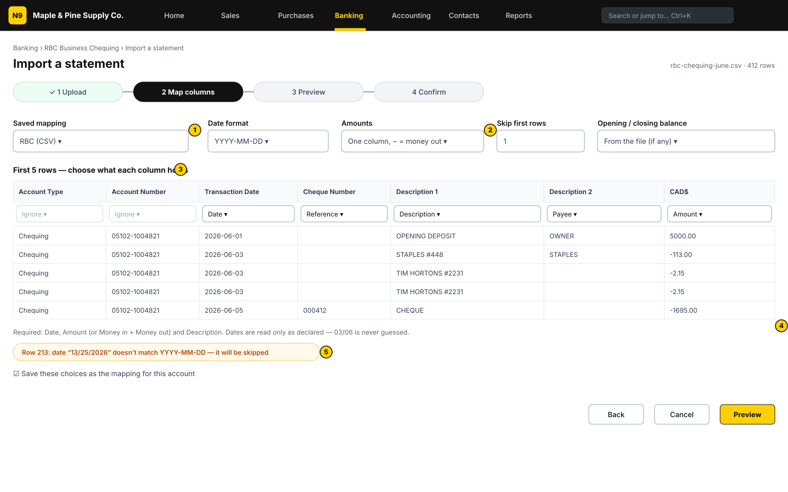

| Marker | Region | Behaviour |
|---|---|---|
| 1 | Saved mapping | Mappings are saved per bank account and reused on the next import |
| 2 | Format options | Date format is declared, amounts as one signed column or Money in / Money out; skip header rows |
| 3 | Mapping grid | First rows of the file; a role per column (Date, Amount, Description, Payee, Reference, Ignore) |
| 4 | Required roles | Date, an amount and Description must be mapped before Preview is enabled; ambiguous dates are never guessed |
| 5 | Row warning | Rows that don't parse are listed with the reason and are skipped, not silently altered |

## 46. Statement import — preview (F-02-T01)

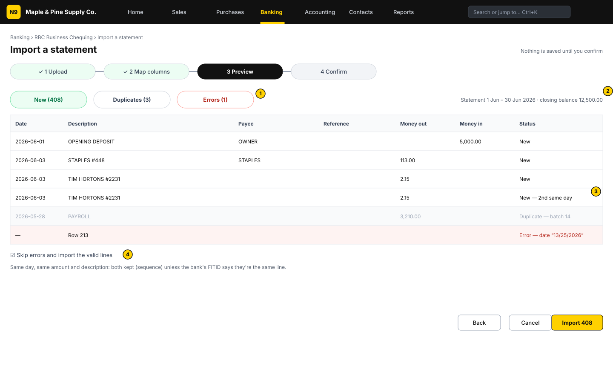

| Marker | Region | Behaviour |
|---|---|---|
| 1 | Status groups | New / Duplicates / Errors with counts; each chip filters the table |
| 2 | Statement period | Period and closing balance from the file, when present |
| 3 | Same-day lines | Identical lines on the same day are both kept (sequence number) unless the bank's FITID marks them the same; true re-imports are duplicates with the batch they came from |
| 4 | Skip errors | Imports the valid lines only; the button shows how many lines will be created |

## 47. Statement imports — history (F-02-T01)

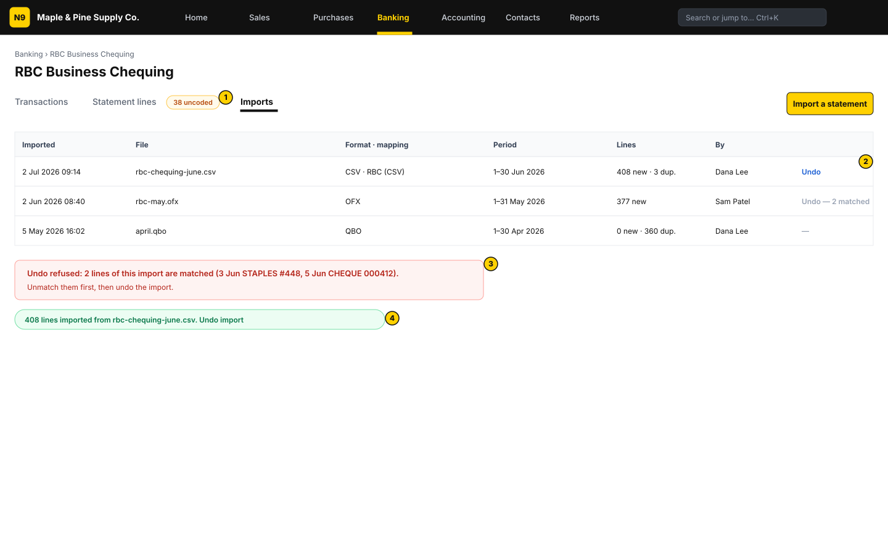

| Marker | Region | Behaviour |
|---|---|---|
| 1 | Tabs | Imports tab on the account; statement lines show an uncoded count |
| 2 | History rows | File, format and mapping, period, new/duplicate counts, who imported; Undo per batch |
| 3 | Undo refused | A batch with matched lines can't be undone until they're unmatched; the lines are named |
| 4 | Toast | After an import, "Undo import" is offered straight away |

## 48. Transfer money dialog (F-06-T01)

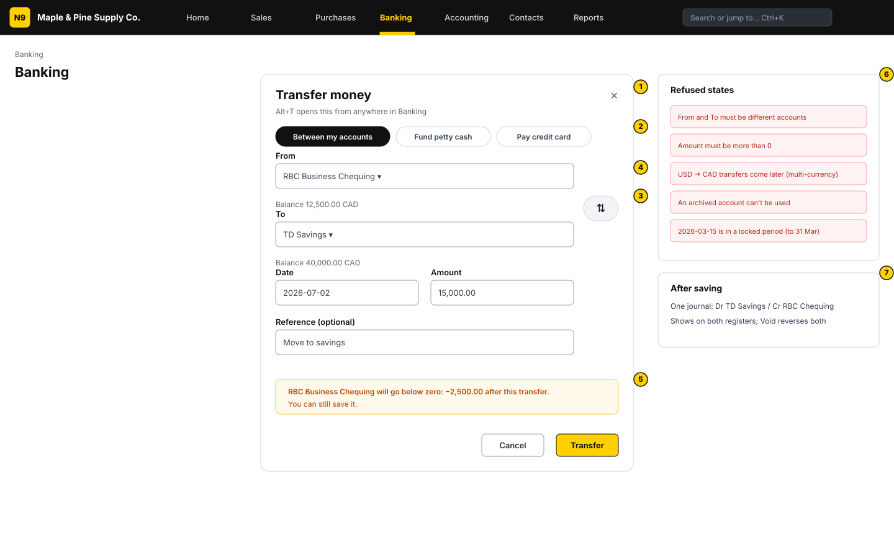

| Marker | Region | Behaviour |
|---|---|---|
| 1 | Dialog | Compact dialog; Alt+T opens it anywhere in Banking |
| 2 | Preset chips | "Between my accounts", "Fund petty cash", "Pay credit card" pre-fill the To/From account kinds |
| 3 | Swap | Swaps From and To in one click |
| 4 | Balances | Current ledger balance under each picker; only active accounts in the same currency are offered |
| 5 | Negative warning | Going below zero warns (F-07) but doesn't block |
| 6 | Refused states | Same account, amount ≤ 0, cross-currency (deferred to R-02), archived account, locked period |
| 7 | Result | One journal with two lines, source TRANSFER, on both registers; Void reverses both sides |

## 49. Bank rules — list and priority (F-04-T01)

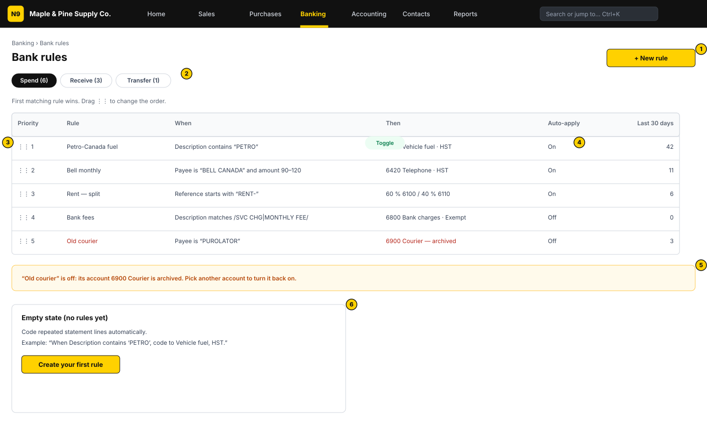

| Marker | Region | Behaviour |
|---|---|---|
| 1 | New rule | Opens the rule builder for the selected type |
| 2 | Type tabs | Spend / Receive / Transfer, each with its count; priority is per type |
| 3 | Priority | Drag handle (and Alt+↑/↓ on the keyboard); the first matching rule wins |
| 4 | Auto-apply toggle | Per rule; off by default; "Last 30 days" counts the lines each rule coded |
| 5 | Disabled rule | A rule pointing at an archived account is turned off with a warning naming the account |
| 6 | Empty state | Explains rules with an example; one primary action |

## 50. Bank rule — sentence builder and allocation (F-04-T01)

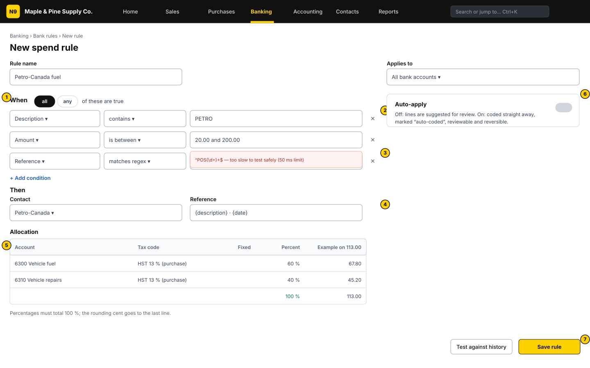

| Marker | Region | Behaviour |
|---|---|---|
| 1 | All / any | Whether every condition or any one must match |
| 2 | Conditions | Field (payee, description, reference, amount, any text field) · operator (equals, contains, does not contain, starts/ends with, regex, is blank, amount between / greater / less) · value |
| 3 | Regex guard | Validated on save; a pattern that can't be tested within 50 ms is refused with the reason |
| 4 | Then | Contact and a reference template (`{description}`, `{date}`, `{reference}`) |
| 5 | Allocation grid | Fixed amounts first, then percentages that must total 100 %; the rounding cent goes to the last percentage line; a tax code per line; the example column shows a 113.00 line split |
| 6 | Scope and auto-apply | All bank accounts or a selected set; auto-apply explained in plain words |
| 7 | Actions | Test against history (next frame) and Save |

## 51. Bank rule — test against history (F-04-T01)

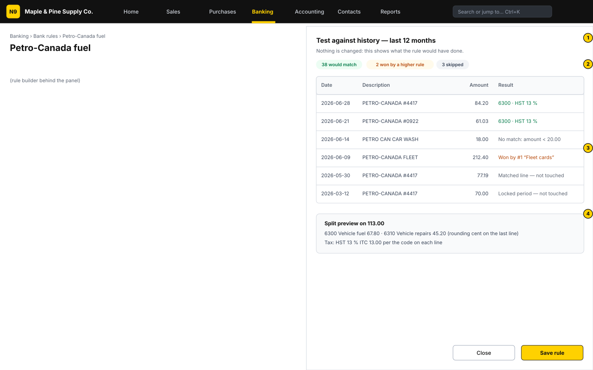

| Marker | Region | Behaviour |
|---|---|---|
| 1 | Side panel | Runs the unsaved rule over the last 12 months; changes nothing |
| 2 | Summary chips | Would match / won by a higher-priority rule / skipped |
| 3 | Results | Per line: the coding it would get, or why not — no match (which condition), a higher rule wins (named), matched or locked-period lines are never touched |
| 4 | Split preview | How the allocation would split a sample line, with the tax per line |
